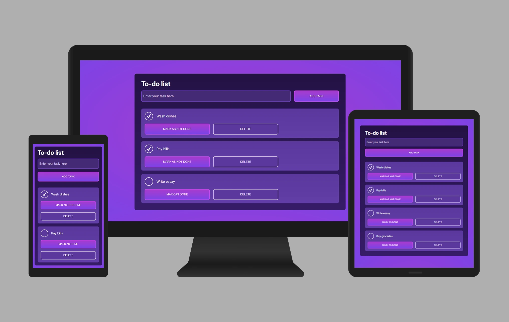

# To-do-list
This is a to-do list app built with HTML, CSS, Python and Django.

## Film of to-do list app in use

## Table of contents

- [Introduction](#introduction)
- [Scope](#scope)
- [User stories](#user-stories)
- [User research](#user-research)
- [Features](#features)
- [Credits](#credits)

## Introduction

In this to-do list app users can add tasks, mark tasks as done and delete tasks.

## Scope

- Ability to add tasks to the database
- Ability to view the tasks they've saved to the database
- Ability to mark tasks as done
- Ability to delete tasks from the database
  
## User stories

| USER STORY                                                                                                              | RESULT         | 
| :--------                                                                                                               | :----------    | 
| As a user I want to be able to add tasks to the to-do list so that I can see what tasks I need to do.                   | PASS           | 
| As a user I want to be able to mark tasks as done so that I can keep track of what tasks I have completed.              | PASS           |
| As a user I want to be able to delete tasks from the to-do list so that I can remove tasks that I no longer need to do. | PASS           |

## User research

### Purpose of research

The purpose of the research was to understand why users use to-do list apps and what they want to achieve while using these types of app and to understand what kind of tasks users carry out on these types of apps.

### Analysing other to-do list apps

Other to-do list apps were analysed with usability testing. The purpose of this was to understand the users experience and pain points while using to-do list apps.

### User research methods

For the qualitative research, I interviewed people who had experience with managing tasks online and for the quantitative research, I carried out a survey to find out about what users expect from a to-do list app.

### Key insights from the user research

- Users want to be able to add tasks to their to-do list app
- Users want the ability to view the tasks they've saved in their to-do list app
- Users want the ability to mark tasks as done on their to-do list app
- Users want the ability to delete tasks from their to-do list app

## Features

- The user can add tasks to the database
- The user can view their tasks
- The user can mark tasks as done
- The user can delete tasks from the list

### Usability testing of features

| FEATURE            |TEST PROCEDURE             | EXPECTED OUTCOME                        | ACTUAL OUTCOME                       | RESULT  |
| :--------            | :----------           | :----------                               | :-----------------                |:--------|
| Form for adding tasks   |  A task was added to the input field and the "ADD TASK" button was pressed. | Pressing the "ADD TASK" button should add a task to the database if there is content in the input field but if there's no content in the input field an error message should appear. |  Pressing the "ADD TASK" button adds a task to the database if there is content in the input field and if there's no content in the input field an error message appears. | PASS  | 
| List of tasks  |  A task was added to the database. | When a task is added to the database it should appear in the list of tasks on the page. |  When a task is added to the database it appears in the list of tasks on the page. | PASS  | 
| "MARK AS DONE" button |  The "MARK AS DONE" button was pressed. | When the "MARK AS DONE" button is pressed the task should get a tick beside it. |  When the "MARK AS DONE" button is pressed the task gets a tick beside it.| PASS  | 
| "DELETE" button |  The "DELETE" button was pressed. | When the "DELETE" button is pressed the task should be deleted from the database and it should be deleted from the task list on the page. | When the "DELETE" button is pressed the task gets deleted from the database and it also gets deleted from the task list on the page. | PASS  | 
  
## Credits

Font Awesome

Dennis Ivy

Codemy

Code With Clinton

Kevin Powell

